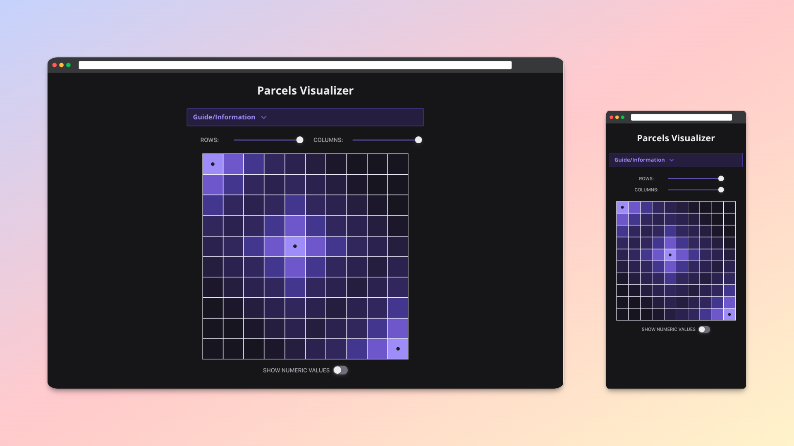

# Kick Start Practice Session #2 - Parcels

This is a visual aid I created to understand the last problem in 2022 Google Coding Practice with Kick Start Session #2.

If you're good at competitive coding you probably wouldn't need a visualizer for this problem. However I'm not, and these practice sessions were untimed, so I made one!

The full problem and submission portal is archived online: [Coding Practice with Kick Start Session #2 - Parcels](https://codingcompetitions.withgoogle.com/kickstart/round/00000000008f4a94/0000000000b55465). Solutions can still be submitted and run against the test cases.


## The Visualizer
The grid is a visual representation of the Manhattan distances from any given square to the nearest delivery office. Click on a square to toggle placing a delivery office there. Brighter colors indicate closer distances.

## Solution files
A brute force solution to the problem (stepping through each point and evaluating placing a delivery office) is included in the `solution/` directory. It uses the same distance function which colors the visualizer grid, and is sufficient to pass the first test set.

I don't know how to pass the second test set :)


## Using TypeScript with Google Kick Start
According to the [Google Kick Start FAQ](https://codingcompetitions.withgoogle.com/kickstart/faq), TypeScript solutions are executed with:

```
tsc Solution.ts --module system --outFile Solution.js
nodejs Solution.js
```

The included solution file `parcels.ts` uses Node.js functions for I/O that fail to compile in this way due to missing type definitions for Node. The easiest workaround is to compile it locally, with type definitions for Node installed, and submit the solution as JavaScript.

You can run the bash script `compileAndRun.sh` to compile the ts solution file into js. This script will also pipe in the Sample Input file (downloaded from the link above) and generate an output file which can be compared against the expected output.

## Testing and Debugging
If you want to work further with this problem (or use the setup for doing other Kick Start problems), you can edit and run `parcels.test.js`, which requires Vitest. The test file imports the solution function and tests against the provided Sample Cases to make sure that the solution file passes. It also checks the output of `compileAndRun.sh`. You can use it to provide your own test cases when generating a solution without needing to compile or do file I/O.